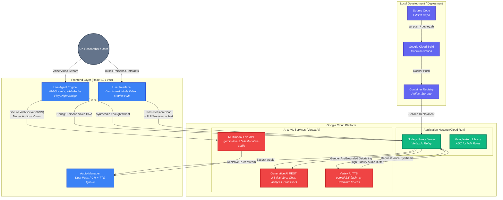

# Rekvin: Architecture Diagram

This diagram illustrates how Rekvin's React frontend securely communicates with Google Cloud AI services via a Node.js proxy deployed on Cloud Run, incorporating the new Gemini TTS and Post-Session debriefing flows.

### Component Breakdown
1. **Frontend Layer**: A React SPA that captures microphone input and screen content at 1fps. It uses a **Dual-Path Audio Manager** that seamlessly blends the raw 24kHz PCM stream from the Live API with high-fidelity speech from the **Gemini TTS Queue** for thoughts and post-session conversations.
2. **Backend Proxy (Cloud Run)**: Acts as a secure relay for Vertex AI. It handles **Gender-Aware Voice Mapping** (categorizing personas to assign `Aoede`, `Charon`, or `Puck`), grounds **Post-Session Debriefs** by injecting full session logs into the chat, and provides a clean REST API for non-websocket features.
3. **AI Services (Vertex AI)**: 
    - **Multimodal Live API**: Zero-latency testing and voice-to-voice interaction.
    - **Gemini REST**: High-reasoning models for session analysis, metrics calculation, and persona-fit verdicts.
    - **Gemini TTS**: Premium voice synthesis that provides character-consistent narration with built-in personality prompts.
4. **Automated Deployment**: The project is containerized via a custom Playwright-ready `Dockerfile` and deployed using `deploy.sh`, which triggers **Google Cloud Build** to push images to **GCR** and refresh the **Cloud Run** service.
