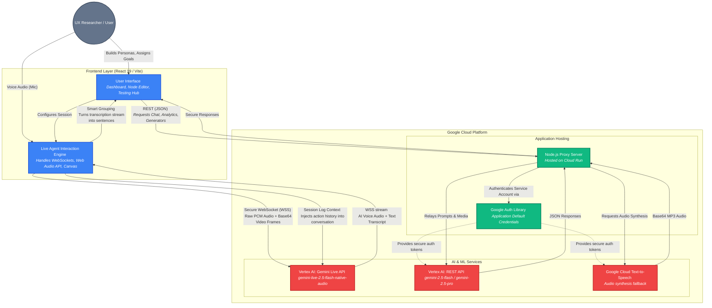

# Rekvin: Architecture Diagram

This diagram illustrates how Rekvin's React frontend securely communicates with Google Cloud AI services via a Node.js proxy deployed on Cloud Run.

### Component Breakdown
1. **Frontend Layer**: A React SPA that captures microphone input, screen content at 1fps, and renders the application state. It connects *directly* to the Gemini Live API via standard WebSockets for minimum latency during live sessions.
2. **Backend Proxy (Cloud Run)**: For all non-live AI generation (analytics reports, chatbot interactions, TTS fallbacks, visual persona building), the frontend pings our Node server. This completely obscures the API keys and GCP resources from malicious client-side use.
3. **Google Auth Library (ADC)**: The backend relies on Application Default Credentials attached to its Google Cloud service account to access Vertex AI securely without needing hardcoded keys in [.env](file:///Users/aniket/Desktop/rekvin/Projects/rekvin---persona-engine/.env) files.
4. **AI Services**: We route live interaction traffic heavily to the new `gemini-live-2.5-flash-native-audio` model on Vertex, fallback analysis/generation to standard `gemini-2.5-flash`, and synthesize fallback voices using Google Cloud Text-to-Speech API.
